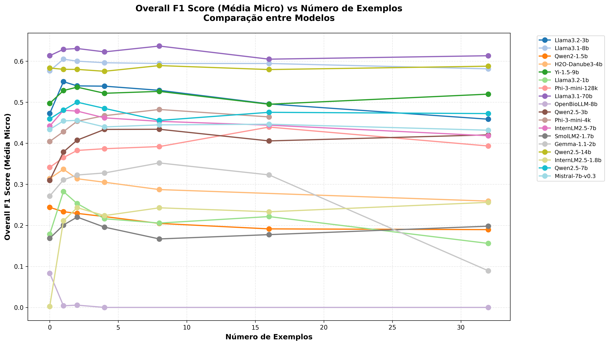
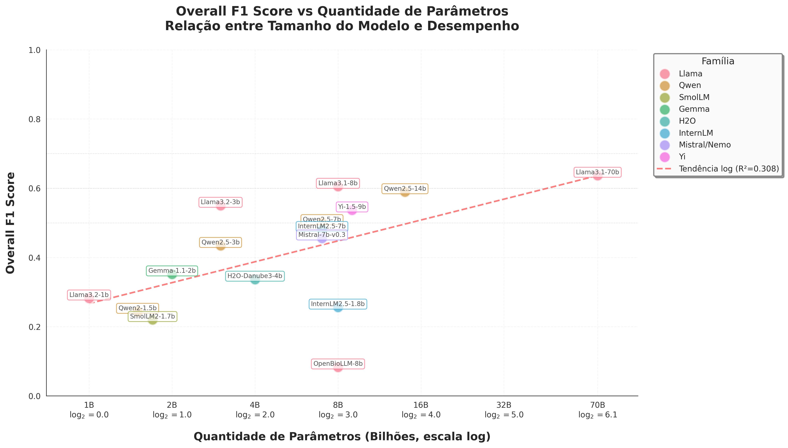
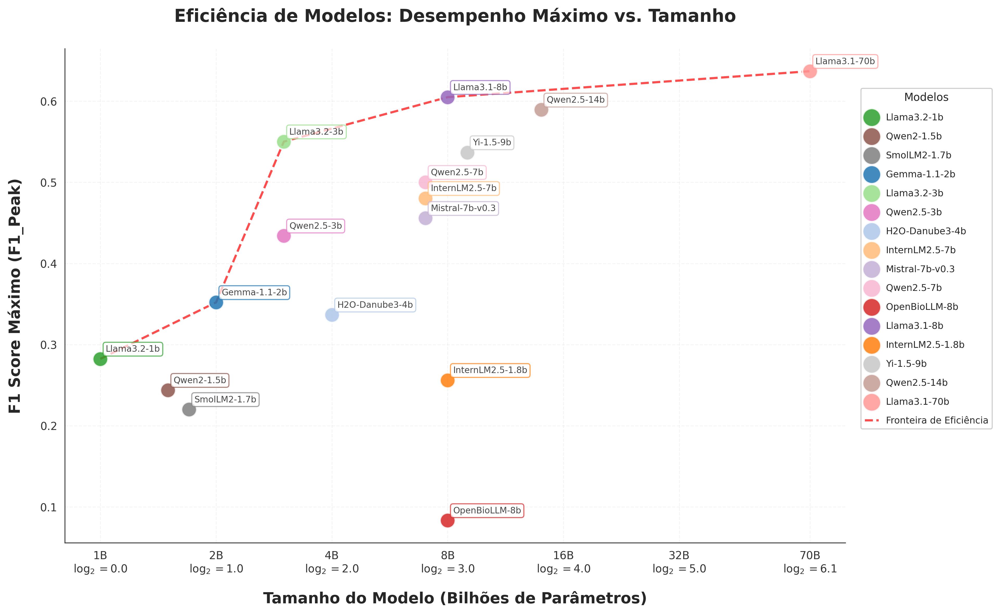
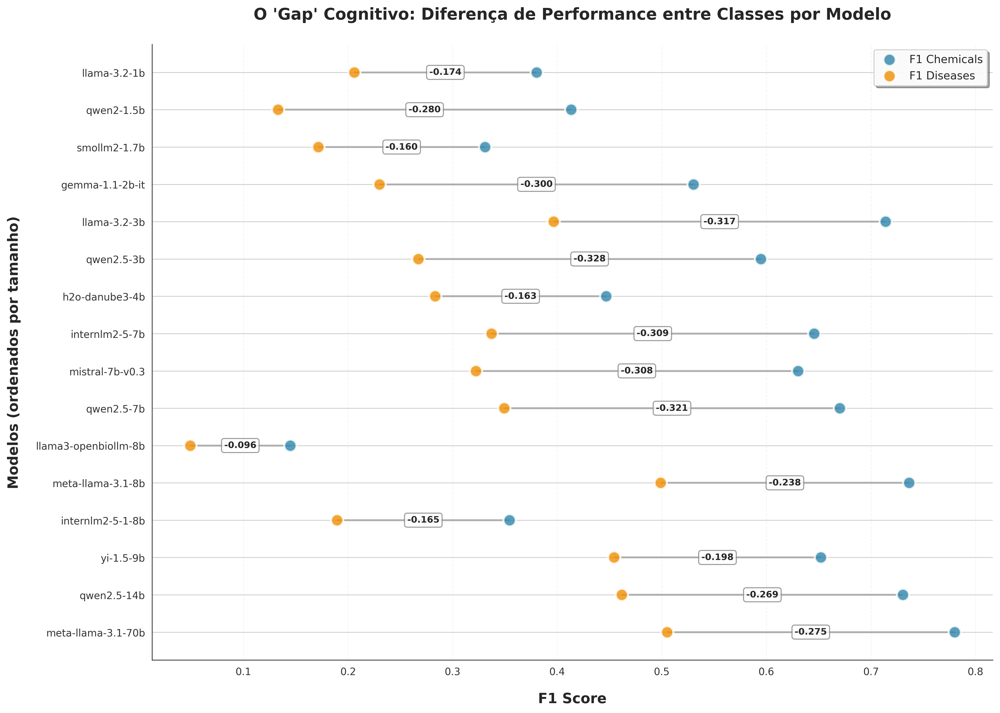
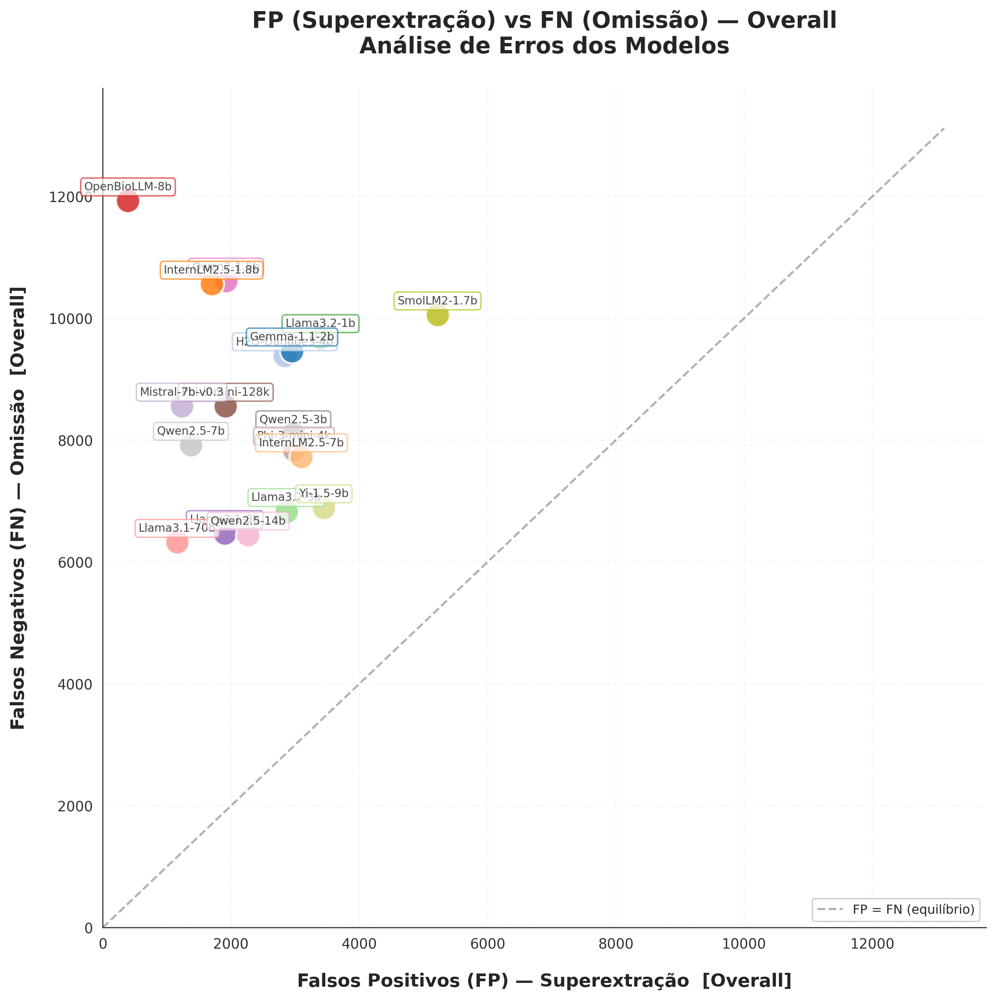
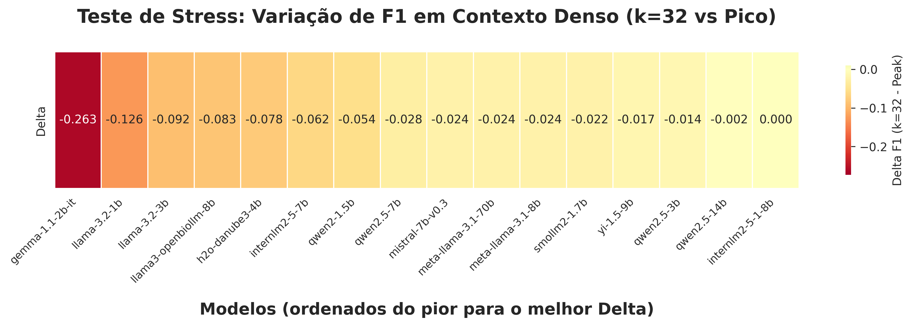

# bioner-llm

Reconhecimento de entidades biomédicas (*named entity recognition*, BioNER) com poucos exemplos (*few-shot*) para produtos químicos e doenças usando grandes modelos de linguagem, avaliado no corpus BC5CDR.

Os LLMs são servidos via [vLLM](https://docs.vllm.ai) em um cluster HPC (SLURM + Singularity) e consultados por meio de um *middleware* FastAPI local. As entidades são extraídas com estratégias de *prompt* que vão de zero-shot a 32-shot, e os resultados são avaliados em relação ao padrão ouro do BC5CDR.

## Resultados

Os experimentos foram conduzidos sobre o corpus completo do BC5CDR (1.500 artigos nos três subconjuntos) com 18 modelos de 9 famílias arquiteturais (1B–70B parâmetros) e 7 densidades de ICL (k ∈ {0, 1, 2, 4, 8, 16, 32}). A avaliação usa correspondência exata de texto normalizado; a métrica primária é o micro-F1 (TP/FP/FN agregados em todos os artigos).

### Melhor desempenho por modelo

| Modelo | Escala | Melhor k | F1 Geral | F1 Quím. | F1 Doenças |
|--------|--------|----------|----------|----------|------------|
| `meta-llama-3.1-70b-instruct` | 70B | 8 | **0,637** | 0,780 | 0,505 |
| `meta-llama-3.1-8b-instruct` | 8B | 1 | **0,605** | 0,737 | 0,499 |
| `qwen2.5-14b-instruct` | 14B | 8 | 0,589 | 0,731 | 0,462 |
| `llama-3.2-3b-instruct` | 3B | 1 | 0,550 | 0,714 | 0,397 |
| `yi-1.5-9b-chat` | 9B | 2 | 0,537 | 0,652 | 0,455 |
| `qwen2.5-7b-instruct` | 7B | 2 | 0,500 | 0,670 | 0,349 |
| `internlm2-5-7b-chat` | 7B | 1 | 0,480 | 0,646 | 0,337 |
| `phi-3-mini-4k-instruct` | 3.8B | 8 | 0,482 | 0,595 | 0,418 |
| `mistral-7b-instruct-v0.3` | 7B | 2 | 0,456 | 0,630 | 0,322 |
| `phi-3-mini-128k-instruct` | 3.8B | 16 | 0,440 | 0,560 | 0,367 |
| `qwen2.5-3b-instruct` | 3B | 8 | 0,434 | 0,595 | 0,267 |
| `gemma-1.1-2b-it` | 2B | 8 | 0,352 | 0,530 | 0,230 |
| `h2o-danube3-4b-chat` | 4B | 1 | 0,337 | 0,447 | 0,283 |
| `llama-3.2-1b-instruct` | 1B | 1 | 0,282 | 0,380 | 0,206 |
| `qwen2-1.5b-instruct` | 1.5B | 0 | 0,244 | 0,413 | 0,133 |
| `internlm2-5-1-8b-chat` | 8B | 32 | 0,256 | 0,354 | 0,189 |
| `smollm2-1.7b-instruct` | 1.7B | 2 | 0,220 | 0,331 | 0,172 |
| `llama3-openbiollm-8b` | 8B | 0 | 0,083 | 0,144 | 0,049 |

### Principais achados

**Escala vs. F1.** Há uma relação log-linear entre o número de parâmetros e o F1, mas a escala não é o único determinante. O `meta-llama-3.1-8b-instruct` (8B) supera modelos com mais parâmetros, incluindo `qwen2.5-14b-instruct` e `yi-1.5-9b-chat`, sugerindo que a qualidade dos dados de pré-treinamento e o ajuste fino de instrução têm peso comparável à escala. O salto de 8B para 70B rende apenas 2–3 pontos de F1 no geral, tornando os modelos de 8B a escolha Pareto-ótima sob restrições de hardware.

**Assimetria Químicos vs. Doenças.** Todos os modelos obtêm melhor desempenho em Químicos (intervalo de F1: 0,14–0,78) do que em Doenças (0,05–0,51). Nomes de produtos químicos seguem padrões morfológicos e IUPAC regulares (reconhecimento lexical); menções a doenças exigem abstração semântica e desambiguação. Essa assimetria se acentua com densidades de ICL mais altas e é mais severa em arquiteturas menores.

**Saturação de ICL.** Exemplos *few-shot* melhoram o F1 até um limiar específico de cada modelo, após o qual o desempenho estagna e então degrada acentuadamente em k=32 nos modelos menores. O `gemma-1.1-2b-it` perde 74,6% do seu F1 de pico de k=8 a k=32. Modelos acima de 7B geralmente permanecem dentro de −6% de degradação; modelos na faixa de 1B–2B são os mais sensíveis.

**Métrica de estabilidade Δ.** Definida como (F1_k32 − F1_pico) / F1_pico × 100%, Δ quantifica a degradação por saturação de contexto. O `llama3-openbiollm-8b` colapsa para Δ = −100% porque abandona a formatação JSON sob contexto denso — uma falha de formatação, não de capacidade de extração. O `qwen2.5-14b-instruct` atinge Δ = −0,3%, a maior resiliência do estudo.

**Perfil de erros.** Em todos os modelos, falsos negativos (omissão) superam falsos positivos (sobre-extração), posicionando a maioria dos modelos acima da diagonal FP=FN. Arquiteturas menores e valores altos de k amplificam o viés de omissão, particularmente na classe Doenças.

### F1 vs. número de exemplos — todos os modelos



### F1 vs. tamanho do modelo (escala logarítmica)



### Fronteira de eficiência (F1 de pico vs. contagem de parâmetros)



### Diferença de F1 entre Químicos e Doenças



### Análise de erros: falsos positivos vs. falsos negativos (geral)



### Mapa de calor de resiliência (Δ = F1_k32 − F1_pico)



---

## Estrutura do projeto

```
bioner-llm/
├── config/                    # Templates de prompt e exemplos few-shot
│   ├── config.yaml            # Configuração de execução (modelo, porta, estratégia)
│   ├── prompts_type1.yaml     # Templates de prompt — Tipo 1 (com posições)
│   ├── prompts_type2.yaml     # Templates de prompt — Tipo 2 (sem posições) ← usado na dissertação
│   ├── examples_type1.yaml    # 32 exemplos few-shot para o Tipo 1
│   └── examples_type2.yaml    # 32 exemplos few-shot para o Tipo 2
│
├── src/
│   ├── api/                   # Middleware FastAPI
│   │   ├── main.py            # Ponto de entrada; expõe o endpoint /extract
│   │   ├── storage_endpoints.py
│   │   └── audit_endpoints.py
│   ├── audit/
│   │   └── metrics_auditor.py # Registro de auditoria (usado pela API)
│   ├── benchmark/
│   │   └── evaluator.py       # BenchmarkEvaluator (correspondência IoU por posição)
│   ├── consensus/
│   │   └── consensus_engine.py # Consenso multi-LLM (votação, ponderado, cascata)
│   ├── llm/
│   │   ├── llm_manager.py     # Cliente LLM único (API OpenAI-compatível do vLLM)
│   │   ├── multi_llm_manager.py
│   │   └── huggingface_manager.py
│   ├── models/
│   │   └── schemas.py         # Esquemas Pydantic (Entity, Metrics, etc.)
│   ├── prompts/
│   │   └── prompt_engine.py   # Constrói prompts a partir de templates YAML + exemplos
│   └── storage/
│       └── response_storage.py # Salva JSONs de extração por artigo
│
├── preprocessing/             # Preparação do dataset BC5CDR (executar uma vez)
│   ├── text_to_df.py          # Parseia PubTator → CSV (gera gold e input)
│   ├── create_combined_cdr_dataset.py  # Parseia os três subconjuntos em um único CSV
│   └── create_validation_datasets.py
│
├── pipeline/                  # Execução do experimento
│   ├── llm_sender.py          # Envia artigos à API; salva JSONs de extração
│   ├── run_multiple_examples.py  # Executa llm_sender para k ∈ {0,1,2,4,8,16,32}
│   ├── api_launcher.py        # Inicia o servidor FastAPI em thread de fundo
│   ├── indicios_to_df.py      # Converte JSONs de extração → CSV (uma linha por artigo)
│   ├── get_results.py         # Calcula P/R/F1 vs gold; grava results.txt
│   ├── check_missing_pmids.py # Reporta quais PMIDs estão ausentes por modelo/estratégia
│   ├── remove_duplicates_pmids.py
│   └── verify_and_clean_pmids.py
│
├── figures/                   # Gráficos de resultados (versionados; gerados por generate_plots.py)
│
├── scripts/
│   └── token_analysis/        # Análise de contagem de tokens por modelo e estratégia
│
├── vllm/                      # Scripts para o cluster HPC
│   ├── example_sbatch.sh      # Script SBATCH anotado — copiar e adaptar por modelo
│   ├── vllm.def               # Definição da imagem Singularity
│   └── llama32_chat_template.jinja
│
├── run_api.py                 # Inicia o middleware FastAPI localmente
├── generate_plots.py          # Gera figuras a partir dos arquivos results.txt
└── requirements.txt
```

## Exemplos

A pasta `examples/` contém amostras funcionais mínimas que espelham a saída real do pipeline — úteis para entender os formatos de arquivo esperados antes de executar o experimento completo.

```
examples/
├── indicios_encontrados_exemplo/        # JSONs de extração (saída de llm_sender.py)
│   └── modelo_exemplo/
│       └── type2/
│           ├── zero_shot/               # 3 artigos, predições imperfeitas (FP/FN presentes)
│           │   ├── extraction_20250101_120000_2004_0.json
│           │   ├── extraction_20250101_120018_26094_0.json
│           │   └── extraction_20250101_120035_56789_0.json
│           └── examples_1/             # mesmos 3 artigos, predições perfeitas
│               ├── extraction_20250101_130000_2004_0.json
│               ├── extraction_20250101_130018_26094_0.json
│               └── extraction_20250101_130035_56789_0.json
└── dataset_exemplo/                     # Saídas processadas (indicios_to_df + get_results)
    └── modelo_exemplo/
        └── type2/
            ├── inferencias/             # Um CSV por estratégia (uma linha por artigo)
            │   ├── modelo_exemplo_zero_shot.csv
            │   └── modelo_exemplo_examples_1.csv
            ├── comparison/              # Comparação gold vs. predito com TP/FP/FN
            │   └── comparison_zero_shot.csv
            └── results.txt             # Relatório P/R/F1 (macro + micro) por estratégia
```

Cada JSON de extração contém as entidades preditas para um artigo:

```json
{
  "pmid": "2004",
  "entities": {
    "chemicals": [{"text": "thioridazine", "type": "Chemical"}],
    "diseases":  [{"text": "ventricular tachycardia", "type": "Disease"}]
  },
  "model": "org/modelo-exemplo",
  "prompt_strategy": "zero-shot",
  "num_examples": 0
}
```

## Arquivos de dados

`data/cdr_gold.csv` está incluído neste repositório — contém as anotações do padrão ouro para os 1.500 artigos do BC5CDR (produtos químicos e doenças por artigo) e é a referência usada em toda a avaliação.

Os seguintes arquivos devem ser gerados localmente antes de executar o pipeline:

| Arquivo | Status | Gerado por | Descrição |
|---------|--------|-----------|-----------|
| `data/cdr_gold.csv` | **versionado** | `preprocessing/create_combined_cdr_dataset.py` | Padrão ouro com entidades anotadas (todos os 1.500 artigos) |
| `data/cdr_ner_dataset.csv` | não versionado | `preprocessing/text_to_df.py` ou `create_combined_cdr_dataset.py` | Textos dos artigos enviados à API para extração (todos os 1.500 artigos) |
| `indicios_encontrados/<model>/<type>/<strategy>/` | não versionado | `pipeline/llm_sender.py` | JSONs de extração por artigo |
| `dataset/<model>/<type>/` | não versionado | `pipeline/get_results.py` | CSVs de comparação + results.txt |

## Configuração

```bash
python -m venv venv
source venv/bin/activate
pip install -r requirements.txt
```

## Executando o experimento

### 1. Preparar o dataset

`data/cdr_gold.csv` já está incluído neste repositório. Para executar o pipeline completo de extração é necessário também o `data/cdr_ner_dataset.csv`, que contém apenas os textos dos artigos (sem anotações) e deve ser gerado a partir dos arquivos PubTator brutos do BC5CDR. Faça o download na [página do BioCreative V CDR task](https://biocreative.bioinformatics.udel.edu/tasks/biocreative-v/track-3-cdr/).

Duas abordagens estão disponíveis, dependendo de como os arquivos do BC5CDR estão organizados localmente.

**Opção A — arquivo combinado único (os três subconjuntos de uma vez):**

```bash
python preprocessing/create_combined_cdr_dataset.py \
    /path/to/CDR_TrainingSet.PubTator \
    /path/to/CDR_DevelopmentSet.PubTator \
    /path/to/CDR_TestSet.PubTator \
    data/cdr_gold.csv \
    data/cdr_ner_dataset.csv
```

**Opção B — um subconjunto por vez, depois concatenar:**

```bash
python preprocessing/text_to_df.py /path/to/CDR_TrainingSet.PubTator    data/train.csv
python preprocessing/text_to_df.py /path/to/CDR_DevelopmentSet.PubTator data/dev.csv
python preprocessing/text_to_df.py /path/to/CDR_TestSet.PubTator        data/test.csv
# depois concatenar train.csv + dev.csv + test.csv em cdr_gold.csv e cdr_ner_dataset.csv
```

`cdr_gold.csv` contém as anotações do padrão ouro (produtos químicos e doenças por artigo) usadas na avaliação. `cdr_ner_dataset.csv` contém apenas os textos dos artigos enviados à API para extração — ambos cobrem os 1.500 artigos.

### 2. Iniciar o servidor vLLM (HPC)

Os modelos foram servidos no [NPAD/UFRN](https://npad.ufrn.br/) (Núcleo de Processamento de Alto Desempenho da Universidade Federal do Rio Grande do Norte), um cluster gerenciado pelo SLURM. O vLLM executa dentro de um contêiner Singularity; cada modelo é um job SBATCH independente em uma porta dedicada.

Copie `vllm/example_sbatch.sh`, defina `MODEL` e `PORT`, e submeta:

```bash
#SBATCH --partition=gpu-8-h100
#SBATCH --gres=gpu:1

MODEL=meta-llama/Meta-Llama-3.1-8B-Instruct
PORT=8000
SIF=/path/to/vllm.sif

singularity exec --nv "$SIF" \
    vllm serve $MODEL --host 0.0.0.0 --port $PORT \
    --max-model-len 16384 --dtype half
```

```bash
# Submeter o job
sbatch vllm/example_sbatch.sh   # adaptar MODEL, PORT e SIF primeiro

# Redirecionar a porta para a máquina local
autossh -M 0 -N -L <porta>:<ip-do-nó>:<porta> -p <porta-ssh> <usuário>@<cluster>
```

Consulte [`vllm/README.md`](vllm/README.md) para o script completo anotado, guia de memória de GPU e solução de problemas.

### 3. Configurar e iniciar o middleware de API

Edite `config/config.yaml` para apontar para o modelo em execução:

```yaml
llm:
  base_url: "http://localhost:<porta>/v1"
  model_name: "<huggingface-model-id>"
```

```bash
python run_api.py
```

### 4. Executar a extração

```bash
# Executar todas as estratégias k-shot (k = 0, 1, 2, 4, 8, 16, 32) para um modelo
python pipeline/run_multiple_examples.py \
    --model <nome-do-modelo> \
    --prompt-type type2 \
    --input data/cdr_ner_dataset.csv
```

As extrações são salvas como arquivos JSON em `indicios_encontrados/<model>/type2/<strategy>/`.

### 5. Calcular métricas

```bash
python pipeline/get_results.py --model <nome-do-modelo> --prompt-type type2
```

Gera P/R/F1 por estratégia em `dataset/<model>/type2/results.txt`.

### 6. Gerar gráficos

```bash
python generate_plots.py
```

Os gráficos são salvos em `figures/`.

## Metodologia de avaliação

A avaliação é realizada em `pipeline/get_results.py` usando **correspondência exata de texto** em menções normalizadas (minúsculas, sem espaços extras). Isso segue a avaliação padrão de NER no nível de menção usada nos benchmarks do BC5CDR.

Para cada artigo e cada tipo de entidade (Chemical, Disease):

```
TP = |gold ∩ predito|    (correspondência exata de texto normalizado)
FP = |predito \ gold|
FN = |gold \ predito|

Precisão  = TP / (TP + FP)
Revocação = TP / (TP + FN)
F1        = 2 · P · R / (P + R)
```

Dois modos de agregação são reportados no `results.txt`:

- **Macro (Média por Artigo)** — P/R/F1 por artigo, depois média entre os artigos (macro-average)
- **Micro (Agregado)** — soma global de TP/FP/FN em todos os artigos, depois P/R/F1 (micro-average)

O resultado primário utilizado em todo o trabalho é o **micro-F1 (Agregado)**.

## Estratégias de prompt

| Estratégia | k (exemplos) | Chave do template |
|------------|-------------|-------------------|
| Zero-shot | 0 | `zero_shot_no_positions` |
| Few-shot | 1, 2, 4, 8, 16, 32 | `few_shot_<k>_no_positions` |

Todas as estratégias usam os templates do **Tipo 2** (`config/prompts_type2.yaml`), que:
- Solicitam apenas o texto e o tipo da entidade (sem posições de caracteres)
- Incluem classes genéricas de medicamentos (e.g., "chemotherapy") como Chemical
- Excluem sintomas gerais e processos biológicos de Disease
- Estão alinhados com as diretrizes de anotação do BC5CDR

Os exemplos são carregados deterministicamente de `config/examples_type2.yaml` (32 no total, não extraídos do BC5CDR).

## Modelos avaliados

| Modelo | Parâmetros | Família |
|--------|-----------|---------|
| SmolLM2-1.7B-Instruct | 1,7 B | SmolLM |
| Llama-3.2-1B-Instruct | 1 B | Llama |
| Qwen2-1.5B-Instruct | 1,5 B | Qwen |
| Qwen2.5-3B-Instruct | 3 B | Qwen |
| Llama-3.2-3B-Instruct | 3 B | Llama |
| H2O-Danube3-4B-Chat | 4 B | H2O Danube |
| Phi-3-Mini-4K-Instruct | 3,8 B | Phi-3 |
| Phi-3-Mini-128K-Instruct | 3,8 B | Phi-3 |
| InternLM2.5-1.8B-Chat | 1,8 B | InternLM |
| InternLM2.5-7B-Chat | 7 B | InternLM |
| Mistral-7B-Instruct-v0.3 | 7 B | Mistral |
| Meta-Llama-3.1-8B-Instruct | 8 B | Llama |
| Llama3-OpenBioLLM-8B | 8 B | Llama (biomédico) |
| Yi-1.5-9B-Chat | 9 B | Yi |
| Qwen2.5-7B-Instruct | 7 B | Qwen |
| Qwen2.5-14B-Instruct | 14 B | Qwen |
| Qwen2.5-32B-Instruct | 32 B | Qwen |
| Meta-Llama-3.1-70B-Instruct | 70 B | Llama |

## Dataset

[BC5CDR](https://www.ncbi.nlm.nih.gov/pmc/articles/PMC4860626/) (BioCreative V Chemical-Disease Relation) — 1.500 resumos do PubMed anotados com menções de Produtos Químicos e Doenças, divididos em subconjuntos de treinamento, desenvolvimento e teste de 500 artigos cada. Os três subconjuntos são utilizados neste experimento.

As anotações do padrão ouro (`data/cdr_gold.csv`) estão incluídas neste repositório. Os arquivos PubTator brutos não estão — faça o download na página do BioCreative V CDR task e siga as instruções em [Preparar o dataset](#1-preparar-o-dataset) para gerar o `cdr_ner_dataset.csv`.
